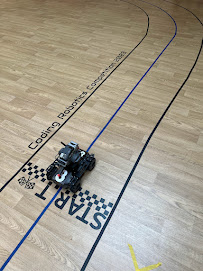

## Teaching Experience

### Computer Science Teacher

{width="33%" align="left"}

As a computer science teacher, Martin has had the opportunity to inspire and educate students of various ages and skill levels. His teaching experience has equipped him with the ability to adapt his teaching style to meet the needs of diverse learners. Martin has taught a range of programming languages, including Python, Haskell, C# and Assembly languages.

One of his notable achievements is introducing **Coding** as a language option for Year 8 and 9 students instead of having a rigid and compulsary Computer Science course for these yeargroups. This innovative approach has proved to be an excellent choice, leading to better engagement in the subject and preparing students for the challenges of the Computer Science GCSE course in Year 10. By introducing coding at an earlier stage, Martin has been able to foster a strong foundation in programming concepts, enabling students to develop a deeper understanding of the subject and build a strong foundation for their future studies.

{width="30%" align="right"}

Martin's commitment to creating a supportive and inclusive learning environment has been instrumental in encouraging students to ask questions and explore their curiosity. Through his teaching, he aims to inspire and educate the next generation of computer scientists and programmers. He believes that by providing students with a solid foundation in programming concepts, he can empower them to succeed in the field of computer science. Martin's teaching approach is centered around creating a collaborative and inclusive learning environment, where students feel encouraged to work together, share ideas, and learn from each other's strengths and weaknesses. By doing so, he aims to equip his students with the skills, knowledge, and confidence required to excel in the field of computer science.

### Innovation as a Subject

The Innovation subject is a unique program that Martin has developed, designed to expose students to a range of thoughts, professions, and innovations across various fields. Students work on three projects each academic year, exploring topics like Artificial Intelligence, Virtual Reality Experiences, and Board Game Development. The focus is on developing transferable skills like resilience, problem-solving, and collaboration.

Through the Innovation subject, Martin aims to provide students with a platform to explore their creativity and develop their problem-solving skills. By working on open-ended projects, students are encouraged to think creatively and develop innovative solutions to real-world problems.

[Image suggestion: A graphic illustrating the various projects and themes explored in the Innovation subject, with images or icons representing each project.]

## Extracurricular Activities

### Blender Modelling ECA

The Blender Modelling ECA is an extracurricular activity that Martin leads, where students learn the basics of 3D modelling and animation using Blender. This activity provides students with an opportunity to explore their creative side, develop their problem-solving skills, and work collaboratively with their peers.

Through the Blender Modelling ECA, Martin aims to provide students with a platform to express their creativity and develop their skills in 3D modelling and animation. By doing so, he hopes to inspire students to pursue careers in the fields of computer graphics, animation, and visual effects.

[Image suggestion: A screenshot of a Blender project or a photo of students working on a Blender project.]

### Coding Clubs

Martin is also involved in leading coding clubs, where students can explore their interest in programming and computer science. These clubs provide a supportive environment for students to learn from each other, work on projects, and develop their coding skills.

Through the coding clubs, Martin aims to provide students with a platform to develop their programming skills and work on collaborative projects. By doing so, he hopes to inspire students to pursue careers in the field of computer science and programming.

[Image suggestion: A photo of students working on a coding project, with laptops and coding materials scattered around the room.]

## Skills

### Programming Languages

* Python
* C++
* Haskell
* Assembly languages
* Processing
* Pygame

### Teaching Methodologies

* Assessment for Learning
* Formative assessment techniques
* Diagnostic questioning
* Mini-whiteboards
* Project-based learning
* Collaborative learning
