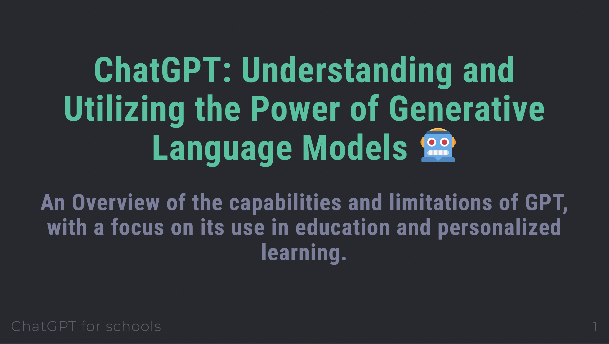

# Bar Point Progression Evidence

## Using this Website

- All relevant evidence for Bar Point Progression are listed under each expectation.
- Each section details the _expectation_ as found in the document [TEACHING STAFF SALARY AND BENEFITS Policy](https://kelletthk.sharepoint.com/:b:/r/sites/StaffHandbook/Shared%20Documents/TEACHING%20STAFF%20SALARY%20AND%20BENEFITS%20Policy.pdf?csf=1&web=1&e=x2GLzk).
- Please use the _navigation panel_ on the left hand side of this page to move between the different sections or scroll up and down the page.
- Each section contains an image **(which is clickable and links to relevant documents)** as well as a short summary.
- Additonal links will be provided where appropriate as a footer to each section.

## Wider Departmental Role

!!! info "Expectation"
    *Contributes fully, in a wider departmental role, to improving student attainment across the whole school, cascading information beyond the department*

---

##### Handbooks

!!! abstract "Contributed to the committee on updating department handbooks"
    [{align="right" style="height:230px;"}](https://kelletthk-my.sharepoint.com/:w:/r/personal/hchan_kellettschool_com/Documents/2022-2023/AH%20docs/Working%20Parties/Department%20Handbook%20Template%20-%20To%20be%20copied.docx?d=wb26679f7b324411b94758f32dc489283&csf=1&web=1&e=I0Gxvi)
    [{align="right" style="height:230px;"}](https://kelletthk-my.sharepoint.com/:w:/r/personal/hchan_kellettschool_com/Documents/2022-2023/AH%20docs/Working%20Parties/Department%20Handbook%20and%20SoW%20Template.docx?d=wd12694f7ad4947a790b2a2889cfa781a&csf=1&web=1&e=pcPG7o)

    Martin actively contributed to the development of a new department handbook and Statement of Work (SoW) template. The goal was to establish a standardized approach across all departments, enhancing the consistency of documentation. By ensuring uniformity in the handbooks, staff members will have an easier time navigating and utilizing them across departments. The final document was utilized to update the existing handbooks and SoWs for all employees.

##### Tech Training

!!! abstract "Led training on technology use in the school"
    [{width="35.5%"}](https://docs.google.com/presentation/d/134mDaJS83Bx6Gm-cRcV5173w9sE6nF2i6ASt-VBKjxM/edit?usp=sharing)
    [{width="29.5%"}](https://drive.google.com/file/d/1x0PzIMwjbPIrZerL3GiJ1Ygn7D35y8PE/view)
    [{width="33.4%"}](https://drive.google.com/file/d/1DUB8hU9uC9sV7SAaKmZmbJ8bWtLnw5T5/view)
    
    During staff induction week 2022-23, Martin conducted multiple training sessions to familiarize new staff members with the use of technology at Kellett. The sessions covered various topics, including the use of iPads, particularly GoodNotes and iPad usage for Year 7 students. Additionally, Martin provided overviews on connecting iPads to Fujitsu boards and using Fujitsu and Domview whiteboard screens.

##### AI (CPD)

!!! abstract "Led training on Artificial Intelligence for feedback, marking and assessment CPD group"
    [{width="30%" align="right" style="clear: right;"}](https://www.youtube.com/watch?v=1wpIm4et-h0)

    Martin conducted a training session for the CPD group focused on utilizing custom AI bots to enhance teacher feedback, grading, and assessment. He demonstrated the practicality of this approach by creating a bot in real-time to aid in marking. The session also explored the possibility of personalized learning for students through subject-specific AI bots. The response from the staff was highly positive, with many recognizing the potential and advantages of this technology.

    Martin also produced a resource for teachers, including the innovation staff on how to create custom chatbots using poe.com

##### AI (Fireside)

!!! abstract "Led a 'Fireside Friday' on Artificial Intelligence"
    [{width="30%" align="left" style="clear: left;"}](./Assets/chatGPT_v02.pdf)
    [{width="30%" align="left" style="clear: left;"}](https://poe.com/ChineseToEnglishKS)
    
    This was Martin's first training session on the usage of Artificial Intelligence in schools, coinciding with the release of ChatGPT. Martin was eager to demonstrate the potential applications of this technology to staff and encourage meaningful conversations with students. During the session, Martin engaged in a conversation with a ChatGPT-powered chatbot, showcasing how to prompt it for desired responses. Notably, Martin collaborated with the Chinese department, using the chatbot to translate Mandarin text. 
    
    Subsequent conversation with members of the Chinese department resulted in Martin authoring a chatbot that the Chinese department could utilize for analyzing and discussing Chinese literature in English, which would be beneficial for English-speaking students learning Mandarin.

##### AI Transcription (Fireside)

!!! abstract "Led a 'Fireside Friday' on Artificial Intelligence and voice transcription for feedback"
    [{width="30%" align="right" style="clear: right;"}](https://otter.ai/u/WLpapY6tmb-0mKeH-W1Jedzl9sk?utm_source=copy_url)

    Martin led a further fireside friday talk focused around the use of an AI transcription tool called otter.ai which he uses to transcribe sections of his lessons with students in order to provide them with a summary of lesson content as well as fast, time of need, personalised feedback. Martin cautioned against the use of this AI 100% of the time, but rather to utilize it when appropriate and necessary, highlighting that for instance this would not be an appropriate tool for recording one on one conversations with students as data is not stored on school machines. Furthermore Martin stressed the need to carefully read and verify what the AI had transcribed and suggested in it's high level summaries.

##### Innovation Skills

!!! abstract "Innovation encourages skills development that are not subject or department specific, we are beginning to see the fruits of this labour in students in Y10 who have already experienced a few years of innovation."
    [{width="30%" align="left" style="clear: left;"}](google.com)

    words

##### Student Leaders

!!! abstract "Manage 4 student leaders in school and 2 deputies."
    [{width="30%" align="right" style="clear: right;"}](google.com)

    words

## Extra Curricular

!!! info "Expectation"
    *Goes above and beyond in their contribution to the wider school community and with their extra-curricular commitment.*

---

##### Blender ECA

!!! abstract "Host the Blender ECA for all three terms"
    [{width="30%" align="right" style="clear: right;"}](google.com)

    words

##### Catch up classes

!!! abstract "Conducting two catch up classes for Y11s and Y13s "
    [{width="30%" align="left" style="clear: left;"}](google.com)

    words

##### Outreach drones

!!! abstract "Flying and programming drones lesson with Outreach students"
    [{width="30%" align="right" style="clear: right;"}](google.com)

    words

##### Y6 Sci Week Drones

!!! abstract "Flying and programming drones lesson with year 6 students during science week (2 years in a row)"
    [{width="30%" align="left" style="clear: left;"}](google.com)

    words

##### 3D Animation Outreach

!!! abstract "3D animation in blender lesson with Outreach students"
    [{width="30%" align="right" style="clear: right;"}](google.com)

    words

##### Programming Outreach

!!! abstract "Programming lesson with Outreach students"
    [{width="30%" align="left" style="clear: left;"}](google.com)

    words

##### CS Intro Y6

!!! abstract "Introductory Computer Science lesson with Y6 students 2 years in a row "
    [{width="30%" align="right" style="clear: right;"}](google.com)

    words

##### Coding Taster

!!! abstract "Coding taster lessons for Language choices"
    [{width="30%" align="left" style="clear: left;"}](google.com)

    words

## Continuous Professional Development (CPD)

!!! info "Expectation"
    *A commitment to ongoing Continuous Professional Development (CPD)*

---

##### Mary Mayatt

!!! abstract "Attended Mary Mayatt training at the start of term and contributed effectively"
    [{width="30%" align="right" style="clear: right;"}](google.com)

    words

##### PyCon

!!! abstract "Attended PyCon Python Conference with Chris Hall"
    [{width="30%" align="left" style="clear: left;"}](google.com)

    words

##### CodeEd CPD Conf

!!! abstract "Led a CPD for Computer Science teachers based in international schools in HK (CodeEd)"
    [{width="30%" align="right" style="clear: right;"}](google.com)

    words

##### Innovation CPD

!!! abstract "Innovation provides many opportunities for development through it’s projects and innovative teaching and learning."
    [{width="30%" align="left" style="clear: left;"}](google.com)

    words

##### mkdocs Portfolio

!!! abstract "Developed this portfolio using mkdocs and markdown notation (consider viability for students to use in Innovation/CS)"
    [{width="30%" align="right" style="clear: right;"}](google.com)

    words

## Training & Research

!!! info "Expectation"
    *Training & Research*

---

##### AI In Curriculum

!!! abstract "Development of Curriculum surrounding AI (Innovation)"
    [{width="30%" align="right" style="clear: right;"}](google.com)

    words

##### AI CS Curriculum

!!! abstract "Development time planned for T3 for curriculum on AI for Y7 students (Computer Science) first delivery 24-25 academic year"
    [{width="30%" align="left" style="clear: left;"}](google.com)

    words

##### AI Server

!!! abstract "Development of AI server within school to allow students to access and use AI"
    [{width="30%" align="right" style="clear: right;"}](google.com)

    words

##### Programmable AI

!!! abstract "R&D into programmable AI using local models for students to understand and create their own use cases for AI"
    [{width="30%" align="left" style="clear: left;"}](google.com)

    words

##### KS3 Innovation 

!!! abstract "Development of the KS3 Innovation curriculum"
    [{width="30%" align="right" style="clear: right;"}](google.com)

    - Introduce a number of new projects to KS3 Innovation 
        - Artificial Intelligence (Y9) 
        - Websites using AI (Y8) 
        - Virtual Reality Experiences (Y8) 
        - Language Scavenger Hunt (Y8) 
        - Board Game Development (UNSDGs) (Y7) 
        - Self Study Project (Y9) 
        - Lego Engineering Challenges (ex Space Elevator) (Y9) 
    - Continue some exiting projects in Innovation 
        - Synthesizer 
        - Stop Motion Animation (moved to Y7) 
        - Hydroponics / Vertical Greenhouse (Moved to Y7) 
    - Embed UNSDGs into all aspects of Innovation 
    - Embed AI into at least one project per year group 
    - Respond to Student and Staff voice by implementing changes: 
        - Introduction of Self Study Project 
        - Split Y8 into 2 large and 2 small projects to accommodate wider range of projects but still be timetable-able and manageable 
        - Reduce complexity of Stop Motion Animation 
        - Reduce complexity of Vertical Greenhouse / Hydroponics 
        - Continue to run Synthesizer Project 
        - Introduce Artificial Intelligence elements 

##### KS4 Innovation

!!! abstract "Start of Innovation/Oceanography KS4 (6 Students, 9 for next academic year)"
    [{width="30%" align="left" style="clear: left;"}](google.com)

    words

## Being part of the Conversation

!!! info "Expectation"
    *Being part of the Conversation: Engages in Educational Debates.*

---

##### AI Working Party

!!! abstract "Active and vocal participant in the AI committee for secondary"
    [{width="30%" align="right" style="clear: right;"}](google.com)

    words

##### DSG

!!! abstract "Active and vocal participant in the Digital Strategy Group"
    [{width="30%" align="left" style="clear: left;"}](google.com)

    words

##### Academic Strategy

!!! abstract "Active and vocal participant in Academic Strategy"
    [{width="30%" align="right" style="clear: right;"}](google.com)

    words

##### Comms Working Party

!!! abstract "Active and vocal participant in Communications Group"
    [{width="30%" align="left" style="clear: left;"}](google.com)

    words

##### COBIS & BSO Tours

!!! abstract "Provided walk and talk for COBIS and BSO inspectors for Innovation projects and received high praise for the subject from both bodies."
    [{width="30%" align="right" style="clear: right;"}](google.com)

    words

##### CodeEd

!!! abstract "Led a CPD for Computer Science teachers based in international schools in HK (CodeEd)"
    [{width="30%" align="left" style="clear: left;"}](google.com)

    words

##### CodeEd AI Panel

!!! abstract "Hosted and participated in panel discussion as a part of CodeEd Panel"
    [{width="30%" align="right" style="clear: right;"}](google.com)

    words

##### HKCS / SEACSTA

!!! abstract "Active and vocal participant in two Computer Science teacher/leader WhatsApp groups"
    [{width="30%" align="left" style="clear: left;"}](google.com)

    words

##### CodeHers

!!! abstract "Active and vocal participant in CodeHers event and external group (9 international school initiative to get more females into Coding)"
    [{width="30%" align="right" style="clear: right;"}](google.com)

    words

## Develops Expertise

!!! info "Expectation"
    *Develops expertise in other teachers, including mentoring training.*

---

##### CAH LM/Obs

!!! abstract "Actively developing Chris Hall CS/Coding teaching via LM and observations"
    [{width="30%" align="right" style="clear: right;"}](google.com)

    words

##### Observations

!!! abstract "Actively encourage Observation from other teachers and attempt to observe others when possible"
    [{width="30%" align="left" style="clear: left;"}](google.com)

    words

##### CodeEd

!!! abstract "Led a CPD for Computer Science teachers based in international schools in HK (CodeEd)"
    [{width="50%" align="right" style="clear: right;"}](google.com)
    [{width="50%" align="right" style="clear: right;"}](google.com)
    [{width="50%" align="right" style="clear: right;"}](google.com)
    [{width="50%" align="right" style="clear: right;"}](google.com)
    [{width="50%" align="right" style="clear: right;"}](google.com)
    [{width="50%" align="right" style="clear: right;"}](google.com)
    [{width="50%" align="right" style="clear: right;"}](google.com)
    [{width="50%" align="right" style="clear: right;"}](google.com)
    [{width="50%" align="right" style="clear: right;"}](google.com)
    [{width="50%" align="right" style="clear: right;"}](google.com)
    

    words

##### Co-teaching In

!!! abstract "Provide opportunities for staff via Co-teaching of Innovation lessons"
    [{width="30%" align="left" style="clear: left;"}](google.com)

    words

##### Innovation CPD

!!! abstract "Provide opportunities for staff to develop new skills via innovation projects"
    [{width="30%" align="right" style="clear: right;"}](google.com)

    words

##### Innovation Mentoring

!!! abstract "Provide opportunities for staff to improve facilitation and mentoring skills via innovation"
    [{width="30%" align="left" style="clear: left;"}](google.com)

    words

##### Technology leader

!!! abstract "Point of reference for other HoDs and Teachers in school with regard to both technology and T&L"
    [{width="30%" align="right" style="clear: right;"}](google.com)

    words

## IT Usage

!!! info "Expectation"
    *Effectively uses IT in teaching and for professional purposes.*

---

##### Computer Science

!!! abstract "Teach Computer Science"
    [{width="30%" align="right" style="clear: right;"}](google.com)

    words

##### Innovation Tecnhnology

!!! abstract "Use of technology across most Innovation projects"
    [{width="30%" align="left" style="clear: left;"}](google.com)

    words

##### Innovation AI

!!! abstract "Use of AI across many Innovation projects"
    [{width="30%" align="right" style="clear: right;"}](google.com)

    words

## Marketing

!!! info "Expectation"
    *Effectively uses IT for departmental/Kellett marketing purposes.*

---

##### CodeEd Marketing

!!! abstract "Marketing for CodeEd event"
    [{width="30%" align="right" style="clear: right;"}](google.com)

    words

##### Social Media CS/Co/In

!!! abstract "Regularly invite Media team to photograph Coding and Innovation Lessons"
    [{width="30%" align="left" style="clear: left;"}](google.com)

    words

##### Social Media CS/Co/In

!!! abstract "Innovation and Coding featured on KS Instagram on several occasions"
    [{width="30%" align="right" style="clear: right;"}](google.com)

    words

##### HKCS / SEACSTA

!!! abstract "Active and vocal participant in two Computer Science teacher/leader whatsapp groups"
    [{width="30%" align="left" style="clear: left;"}](google.com)

    words

##### CodeHers

!!! abstract "Active and vocal participant in CodeHers event and external group (9 international school initiative to get more females into Coding)"
    [{width="30%" align="right" style="clear: right;"}](google.com)

    words

## Leadership in Teaching and Learning

!!! info "Expectation"
    *Shows leadership in teaching and learning.*

---

##### Fireside Fridays

!!! abstract "Led multiple fireside Friday events and staff training events as a part of CPD"
    [{width="30%" align="right" style="clear: right;"}](google.com)

    words

##### Oration Skills

!!! abstract "Praised for talks and lessons by teachers for oration and presentation style"
    [{width="30%" align="left" style="clear: left;"}](google.com)

    words

##### Observations

!!! abstract "Conduct regular observations and drop ins of teachers"
    [{width="30%" align="right" style="clear: right;"}](google.com)

    words

##### Review 360

!!! abstract "Positively reviewed by subordinates via 360 leadership review"
    [{width="30%" align="left" style="clear: left;"}](google.com)

    words

## Working Groups

!!! info "Expectation"
    *Contributes to School working groups.*

---

##### AI Working Party

!!! abstract "Active and vocal participant in the AI committee for secondary"
    [{width="30%" align="right" style="clear: right;"}](google.com)

    words

##### DSG

!!! abstract "Active and vocal participant in the Digital Strategy Group"
    [{width="30%" align="left" style="clear: left;"}](google.com)

    words

##### Academic Strategy

!!! abstract "Active and vocal participant in Academic Strategy"
    [{width="30%" align="right" style="clear: right;"}](google.com)

    words

##### Comms Working Party

!!! abstract "Active and vocal participant in Communications Group"
    [{width="30%" align="left" style="clear: left;"}](google.com)

    words

##### Student Leaders

!!! abstract "Manage 4 student leaders in school and 2 deputies"
    [{width="30%" align="right" style="clear: right;"}](google.com)

    words
