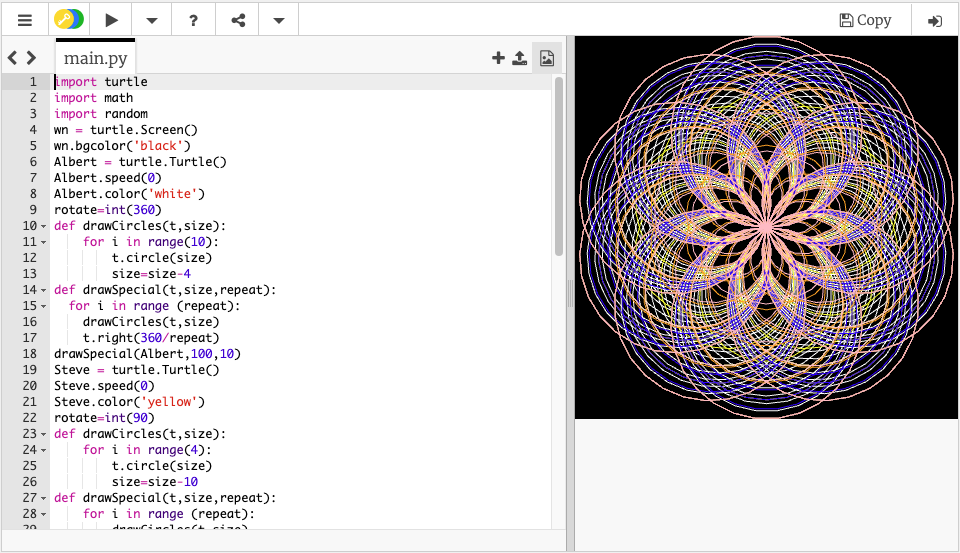

# Bar Point Progression Evidence

## Using this Website

- All relevant evidence for Bar Point Progression are listed under each expectation.
- Each section details the _expectation_ as found in the document [TEACHING STAFF SALARY AND BENEFITS Policy](https://kelletthk.sharepoint.com/:b:/r/sites/StaffHandbook/Shared%20Documents/TEACHING%20STAFF%20SALARY%20AND%20BENEFITS%20Policy.pdf?csf=1&web=1&e=x2GLzk).
- Please use the _navigation panel_ on the left hand side of this page to move between the different sections or scroll up and down the page.
- Each section contains an image **(which is clickable and links to relevant documents)** as well as a short summary.
- Additonal links will be provided where appropriate as a footer to each section.

## Wider Departmental Role

!!! info "Expectation"
    *Contributes fully, in a wider departmental role, to improving student attainment across the whole school, cascading information beyond the department*

---

##### Handbooks

??? abstract "Contributed to the committee on updating department handbooks"
    [{align="right" style="height:230px;"}](https://kelletthk-my.sharepoint.com/:w:/r/personal/hchan_kellettschool_com/Documents/2022-2023/AH%20docs/Working%20Parties/Department%20Handbook%20Template%20-%20To%20be%20copied.docx?d=wb26679f7b324411b94758f32dc489283&csf=1&web=1&e=I0Gxvi)
    [{align="right" style="height:230px;"}](https://kelletthk-my.sharepoint.com/:w:/r/personal/hchan_kellettschool_com/Documents/2022-2023/AH%20docs/Working%20Parties/Department%20Handbook%20and%20SoW%20Template.docx?d=wd12694f7ad4947a790b2a2889cfa781a&csf=1&web=1&e=pcPG7o)

    Martin actively contributed to the development of a new department handbook and Statement of Work (SoW) template. The goal was to establish a standardized approach across all departments, enhancing the consistency of documentation. By ensuring uniformity in the handbooks, staff members will have an easier time navigating and utilizing them across departments. The final document was utilized to update the existing handbooks and SoWs for all employees.

##### Tech Training

??? abstract "Led training on technology use in the school"
    [{width="35.5%"}](https://docs.google.com/presentation/d/134mDaJS83Bx6Gm-cRcV5173w9sE6nF2i6ASt-VBKjxM/edit?usp=sharing)
    [{width="29.5%"}](https://drive.google.com/file/d/1x0PzIMwjbPIrZerL3GiJ1Ygn7D35y8PE/view)
    [{width="33.4%"}](https://drive.google.com/file/d/1DUB8hU9uC9sV7SAaKmZmbJ8bWtLnw5T5/view)
    
    During staff induction week 2022-23, Martin conducted multiple training sessions to familiarize new staff members with the use of technology at Kellett. The sessions covered various topics, including the use of iPads, particularly GoodNotes and iPad usage for Year 7 students. Additionally, Martin provided overviews on connecting iPads to Fujitsu boards and using Fujitsu and Domview whiteboard screens.

##### AI (CPD)

??? abstract "Led training on Artificial Intelligence for feedback, marking and assessment CPD group"
    [{width="30%" align="right" style="clear: right;"}](https://www.youtube.com/watch?v=1wpIm4et-h0)

    Martin conducted a training session for the CPD group focused on utilizing custom AI bots to enhance teacher feedback, grading, and assessment. He demonstrated the practicality of this approach by creating a bot in real-time to aid in marking. The session also explored the possibility of personalized learning for students through subject-specific AI bots. The response from the staff was highly positive, with many recognizing the potential and advantages of this technology.

    Martin also produced a resource for teachers, including the innovation staff on how to create custom chatbots using poe.com

##### AI (Fireside)

??? abstract "Led a 'Fireside Friday' on Artificial Intelligence"
    [{width="30%" align="left" style="clear: left;"}](./Assets/chatGPT_v02.pdf)
    [{width="30%" align="left" style="clear: left;"}](https://poe.com/ChineseToEnglishKS)
    
    This was Martin's first training session on the usage of Artificial Intelligence in schools, coinciding with the release of ChatGPT. Martin was eager to demonstrate the potential applications of this technology to staff and encourage meaningful conversations with students. During the session, Martin engaged in a conversation with a ChatGPT-powered chatbot, showcasing how to prompt it for desired responses. Notably, Martin collaborated with the Chinese department, using the chatbot to translate Mandarin text. 
    
    Subsequent conversation with members of the Chinese department resulted in Martin authoring a chatbot that the Chinese department could utilize for analyzing and discussing Chinese literature in English, which would be beneficial for English-speaking students learning Mandarin.

##### AI Transcription (Fireside)

??? abstract "Led a 'Fireside Friday' on Artificial Intelligence and voice transcription for feedback"
    [{width="30%" align="right" style="clear: right;"}](https://otter.ai/u/WLpapY6tmb-0mKeH-W1Jedzl9sk?utm_source=copy_url)

    Martin led a further fireside friday talk focused around the use of an AI transcription tool called otter.ai which he uses to transcribe sections of his lessons with students in order to provide them with a summary of lesson content as well as fast, time of need, personalised feedback. Martin cautioned against the use of this AI 100% of the time, but rather to utilize it when appropriate and necessary, highlighting that for instance this would not be an appropriate tool for recording one on one conversations with students as data is not stored on school machines. Furthermore Martin stressed the need to carefully read and verify what the AI had transcribed and suggested in it's high level summaries.

##### Innovation Skills

??? abstract "Innovation encourages skills development that are not subject or department specific, we are beginning to see the fruits of this labour in students in Y10 who have already experienced a few years of innovation."
    [{width="30%" align="left" style="clear: left;"}](google.com)

    Students are expected to possess a specific set of skills in school, which are not explicitly taught and can be challenging to acquire without projects that foster these skills. These skills include problem-solving, perseverance, teamwork, individual work, time management, planning, and adaptability. While other subjects have limited opportunities to develop these skills, innovation prioritizes them above all else, including grades. Although this approach may initially pose challenges for students, we anticipate that after completing three years of innovation as a dedicated subject, they will emerge with an enhanced skillset and refined personal attributes that will benefit them across all subjects.

    Teachers often express their desire to see these skills and attributes developed in our students, and I believe that Innovation takes a proactive approach in addressing them.

##### Student Leaders

??? abstract "Manage 4 student leaders in school and 2 deputies."
    [{width="30%" align="right" style="clear: right;"}](google.com)

    Martin manages several student leaders within school, these students are involved in a number of high profile events. Martin supports these students with one on one meetings or team meetings where appropriate and required. Martin is keen for students to come up with their own solutions and often uses socratic questioning in order to guide student leaders without giving them the answers.

    Martin Co-manages the Whole School prefect for Innovation and Technology, who is in charge of the two Innovation subject prefects who in turn are in charge of two deputies as well as the Computer Science subject prefect. Martin is in regular contact with all of these individuals in a mentoring capacity, so far these students have been inovled in several whole school initiatives and are contributing effectively to the school community with Martin's guidance.

## Extra Curricular

!!! info "Expectation"
    *Goes above and beyond in their contribution to the wider school community and with their extra-curricular commitment.*

---

##### Blender ECA

??? abstract "Host the Blender ECA for all three terms"
    [{width="30%" align="right" style="clear: right;"}](google.com)

    Martin has hosted a weekly Blender ECA in the past two terms and continues to do so this term. Having previously worked in the Animation and Visual Effects industry prior to teaching Martin is keen to pass on his knowledge and skills to the students. Students are given a whirlwind tour of the range of areas of this complex, artisitic, technical yet intriguing field. Students often will work independently of the ECA to improve their abilities in this area and several have gone on to complete further projects as a direct result of taking this ECA.

##### Catch up classes

??? abstract "Conducting two catch up classes for Y11s and Y13s "
    [{width="30%" align="left" style="clear: left;"}](google.com)

    Martin is committed to helping his students achieve their full potential in their public examinations. To support this, he offers two weekly catch-up classes for students who are falling behind or have missed content. Martin conducts catch-up sessions on Thursdays for Year 11 students and on Fridays for Year 13 students. During these sessions, students have the flexibility to choose the specific topics they need to cover. Additionally, some of these sessions are used for assessing student knowledge and enhancing their examination techniques and revision strategies.

##### Outreach drones

??? abstract "Flying and programming drones lesson with Outreach students"
    [{width="30%" align="right" style="clear: right;"}](google.com)

    Martin has successfully organized and facilitated multiple Outreach programs. One notable program involved teaching students about programming and flying drones in the atrium. This particular session required careful planning and preparation to ensure a smooth and engaging learning experience for students who were not typically taught by Martin. The program received positive feedback from the outreach students, with many expressing newfound interest and appreciation for programming and Computer Science.

##### Y6 Sci Week Drones

??? abstract "Flying and programming drones lesson with year 6 students during science week (2 years in a row)"
    [{width="30%" align="left" style="clear: left;"}](google.com)

    Martin organizes an annual session during Year 6 science week where students have the chance to learn about drone control through simple block-based programming. This activity allows them to connect their learning to the different themes of science week. The students greatly appreciate this session and find it highly beneficial.

##### 3D Animation Outreach

??? abstract "3D animation in blender lesson with Outreach students"
    [{width="30%" align="right" style="clear: right;"}](google.com)

    Martin has a proven track record of organizing and leading various Outreach programs. One noteworthy program focused on educating students about 3D animation using Blender software. During the program, students were provided with a pre-made animation model to work with, which they could animate according to their own creativity. Martin began by giving a brief introduction to the tools, shortcuts, and fundamental principles of 3D animation. Following this, students were given the freedom to animate their chosen character. The sessions resulted in the creation of impressive and imaginative animations by the students.

##### Programming Outreach

??? abstract "Programming lesson with Outreach students"
    [{width="40%" align="left" style="clear: left;"}](google.com)

    Martin organized a programming lesson for the outreach program, teaching students how to create spirograph drawings using Python code. The lesson was designed to make students feel confident and empowered in their ability to use Python, even if they were not familiar with coding. By using programming, students were able to create intricate designs that would have been challenging to achieve without technology.

    In addition, Martin has provided guidance to the Computer Science department prefect, who, with the assistance of CS students, successfully conducted outreach programming sessions.

##### CS Intro Y6

??? abstract "Introductory Computer Science lesson with Y6 students 2 years in a row "
    [{width="30%" align="right" style="clear: right;"}](google.com)

    Martin regularly conducts taster sessions on Computer Science for Year 6 students in secondary school. During these sessions, students have the opportunity to create intricate patterns using program code and a 'turtle' that draws for them. The main goal of these sessions is to familiarize younger students with text-based programming, as opposed to the more commonly used block-based programming. By engaging in this activity, students gain insight into what secondary education entails and develop an appreciation for the capabilities of text-based programming and the power of utilizing computers and technology.

##### Coding Taster

??? abstract "Coding taster lessons for Language choices"
    [{width="30%" align="left" style="clear: left;"}](google.com)

    In order for students in years 8 and 9 to choose Coding as a language option, it is important for them to understand what this entails. Therefore, Martin organizes and teaches taster sessions for Year 7 language students. These sessions provide a comprehensive introduction to Coding, including an overview of the subject, the expected learning outcomes, the necessary skills and attributes, and the potential career paths associated with this elective subject.

## Continuous Professional Development (CPD)

!!! info "Expectation"
    *A commitment to ongoing Continuous Professional Development (CPD)*

---

##### Mary Mayatt

??? abstract "Attended Mary Mayatt training at the start of term and contributed effectively"
    [{width="30%" align="right" style="clear: right;"}](google.com)

    Martin actively participated in a training session conducted by Mary Mayatt at the start of the year. This training served as a valuable opportunity for Martin to reflect on and enhance both the Computer Science and Innovation curricula. Martin successfully integrated the core principles and methodologies from the training into their Computer Science and Innovation lessons, immediately implementing the learned strategies.

##### PyCon

??? abstract "Attended PyCon Python Conference with Chris Hall"
    [{width="30%" align="left" style="clear: left;"}](google.com)

    Martin and Chris Hall recently participated in the PyCon Python Conference held in Hong Kong. The conference provided valuable insights into the practical applications of Python in various industries. They also had the opportunity to learn from other educators who shared their experiences of teaching and utilizing Python in their classrooms. The conference proved to be highly beneficial, enhancing their ability to provide students with better advice and guidance on using Python modules for non-examined assessments and other projects.

##### DT H&S Training

??? abstract "Attended Design Technology Health and Safety Training"
    [{width="30%" align="right" style="clear: right;"}](google.com)

    Martin successfully completed a two-day DATA Certified Design Technology Health and Safety training session under the guidance of external trainer Mr. Mark Elwell. As a result, Martin is now certified to operate and provide training on the various machines in the design and technology labs. This certification is crucial for Innovation, as it frequently relies on the department's machines for its operations.

##### CodeEd CPD Conf

??? abstract "Led a CPD for Computer Science teachers based in international schools in HK (CodeEd)"
    [{width="30%" align="left" style="clear: left;"}](google.com)

    Martin successfully organized and led the inaugural CodeEd conference, a gathering of Computer Science HoDs and teachers aimed at sharing expertise and information. The event featured presentations, workshops, and a panel discussion centered around artificial intelligence. Martin not only coordinated the event and handled attendee communication, but also made two presentations, conducted two workshops, and led the panel discussion. The conference received very positive feedback from attendees, and plans are underway to host the event again next year, this time at another international school.

##### Innovation CPD

??? abstract "Innovation provides many opportunities for development through it’s projects and innovative teaching and learning."
    [{width="30%" align="right" style="clear: right;"}](google.com)

    Martin frequently offers his colleagues Continuing Professional Development (CPD) opportunities in the field of innovation. These projects are designed to be led and facilitated by individuals who are not necessarily specialists in the subject matter. Through these projects, participants gradually acquire new skills while also setting an example of effective learning practices for the students. For example, this year, teachers have engaged in various projects such as designing websites using Artificial Intelligence, creating virtual reality experiences, developing board games centered around the UN's sustainable development goals, and constructing soft robots using air pressurized plastic tubing. These projects have proven to be both interesting and novel and teachers have had the opportunity to explore not only new topics but also new methods of teaching and learning.

## Training & Research

!!! info "Expectation"
    *Training & Research*

---

##### AI In Curriculum

??? abstract "Development of Curriculum surrounding AI (Innovation)"
    [{width="30%" align="right" style="clear: right;"}](google.com)

    Martin has introduced AI into the Innovation curriculum for all year groups this year. Each year group is assigned a project involving generative AI to ensure that students have a safe and secure environment to explore this emerging and transformative technology. Year 7 students are collaboratively creating board games with AI, Year 8 students are developing websites with AI integration, and Year 9 students are working on creative projects with AI, such as composing Christmas and graduation songs, as well as a house chant. Martin recognizes the importance of familiarizing students with the power and wide-ranging implications of artificial intelligence. By incorporating it into the Innovation program, Martin aims to provide students with a platform to explore this exciting field of development, fulfilling the true essence of innovation as defined in the dictionary.

##### AI CS Curriculum

??? abstract "Development time planned for T3 for curriculum on AI for Y7 students (Computer Science) first delivery 24-25 academic year"
    [{width="30%" align="left" style="clear: left;"}](google.com)

    Martin is currently engaged in the development of a new Computer Science curriculum for the upcoming academic year. As part of this initiative, he is working on a project centered around artificial intelligence (AI) that will be specifically designed for Year 7 students. The objective of this project is to educate students about the proper usage of AI products, with a particular focus on promoting safety. Additionally, Martin is eager to create a coding project for advanced students that delves into programming systems utilizing AI to process information. An example of such a project could involve developing an application capable of detecting and classifying objects in images.

##### AI Server

??? abstract "Development of AI server within school to allow students to access and use AI"
    [{width="30%" align="right" style="clear: right;"}](google.com)

    During the first term of this academic year, Martin developed an AI server within the school. This server provided an image generation platform for both staff and students. While it offered more control over image generation, it required a higher level of understanding than what the staff and students possessed. In the second term, Martin discontinued the system as poe.com introduced new image generation features. These features can be easily accessed in Hong Kong. Although they are not as advanced as the AI server, they are much simpler for students to comprehend. The AI server is likely to undergo redesign and redeployment in the upcoming year to complement the AI curriculum in Computer Science, Coding, and Innovation.

##### Programmable AI

??? abstract "R&D into programmable AI using local models for students to understand and create their own use cases for AI"
    [{width="30%" align="left" style="clear: left;"}](google.com)

    Martin is motivated to develop a coding project targeted at advanced students. The project aims to explore programming systems that utilize AI for efficient information processing. For instance, one possible project idea involves creating an application that can detect and classify objects in images. The project will leverage local models, utilizing the computer science lab computers. This approach will demonstrate to students that AI is more accessible than they may perceive.

##### KS3 Innovation 

??? abstract "Development of the KS3 Innovation curriculum"
    [{width="30%" align="right" style="clear: right;"}](google.com)

    In the KS3 Innovation program, we have introduced a range of new projects that aim to foster creativity and critical thinking among our students. These include the incorporation of Artificial Intelligence (AI) in the curriculum for Year 9 students, enabling them to explore the potential of this emerging technology. Additionally, Year 8 students have been engaged in developing websites that utilize AI, as well as experiencing Virtual Reality to enhance their learning. In Year 8, we have also introduced a Language Scavenger Hunt project, which promotes language acquisition and cultural understanding. Moreover, Year 7 students are now involved in Board Game Development projects that align with the United Nations Sustainable Development Goals (UNSDGs). Furthermore, Year 9 students have been given the opportunity to pursue self-study projects tailored to their individual interests. Lastly, our curriculum now includes Lego Engineering Challenges, such as the recently introduced Space Elevator project, for Year 9 students.

    In addition to these new projects, we have continued several existing initiatives in the Innovation program. These include the Synthesizer project, which allows students to explore music production and sound engineering. We have also moved the Stop Motion Animation and Hydroponics/Vertical Greenhouse projects to Year 7, providing younger students with hands-on experience in these areas.

    To ensure that our Innovation program remains relevant and aligned with the needs of our students and staff, we have taken steps to embed the UNSDGs into all aspects of our curriculum. This integration allows students to understand and address global challenges through their projects. Furthermore, we have made a deliberate effort to incorporate AI elements into at least one project per year group, enabling students to explore the potential applications of AI in various fields.

    To address feedback from our students and staff, we have implemented several changes to the program. Firstly, we introduced the Self Study Project, which gives students the opportunity to pursue independent research and exploration. Additionally, we have split Year 8 into two larger and two smaller projects, allowing for a wider range of project options while still maintaining a manageable and timetabled structure. Furthermore, we have simplified the complexity of the Stop Motion Animation and Vertical Greenhouse/Hydroponics projects to ensure a more accessible and engaging experience for students.

    Overall, this year has seen significant progress in the field of Innovation, with the introduction of new projects, the continuation of existing initiatives, and the implementation of changes based on student and staff feedback. We are committed to providing an engaging and forward-thinking curriculum that prepares our students for the challenges and opportunities of the future.

##### KS4 Innovation

??? abstract "Start of Innovation/Oceanography KS4 (6 Students, 9 for next academic year)"
    [{width="30%" align="left" style="clear: left;"}](google.com)

    We have implemented a joint Innovation Oceanography project as a new option for GCSE students. Currently, we have six students enrolled in the project, and we anticipate that nine more will join in August 2024. Our students' final projects are currently evaluated using the HPQ assessment framework. However, we aim to transition to the Mastery Credits framework for assessment in the future. Additionally, we have aspirations to obtain accreditation for the course from industry and university partners moving forward.

##### mkdocs Portfolio

??? abstract "Developed this portfolio using mkdocs and markdown notation (consider viability for students to use in Innovation/CS)"
    [{width="30%" align="right" style="clear: right;"}](google.com)

    This portfolio showcases a new technique that Martin plans to implement for creating, managing, and maintaining his various resources. These resources include curriculum materials, slides, programming challenges, and other relevant materials. Martin utilizes markdown notation to write the content of the website and then processes it through a program called MkDocs. This conversion process transforms the markdown notation into a user-friendly website with navigation, images, and other interactive elements. This approach offers several advantages. Firstly, the core content is in a universally readable format that is compatible with any operating system. Additionally, the website can be customized and rendered in multiple ways, making it flexible and adaptable. This method simplifies the process of updating and sharing the content with others, ensuring ease of maintenance and accessibility.

## Being part of the Conversation

!!! info "Expectation"
    *Being part of the Conversation: Engages in Educational Debates.*

---

##### AI Working Party

??? abstract "Active and vocal participant in the AI committee for secondary"
    [{width="30%" align="right" style="clear: right;"}](google.com)

    As an active and engaged member of the AI committee, I am dedicated to fostering positive change and innovation within our school. I actively contribute insights, engage in discussions, and challenge traditional approaches to integrate AI into my own teaching practices, serving as an inspiration for others to do the same. Additionally, I make it a priority to stay up-to-date with the latest advancements in AI, offering my support and expertise to fellow colleagues seeking to incorporate AI into their own classrooms. By preparing students for an AI-driven future, we equip them with the essential skills needed to thrive in the evolving educational landscape.

##### DSG

??? abstract "Active and vocal participant in the Digital Strategy Group"
    [{width="30%" align="left" style="clear: left;"}](google.com)

    Martin was a dedicated member of the Digital Strategy Group, actively participating in important decision-making processes and shaping digital policies. While he may have had other commitments in the last year, he has remained informed about the group's discussions and decisions. Martin continues to provide support and advice whenever possible and appropriate.

##### Academic Strategy

??? abstract "Active and vocal participant in Academic Strategy"
    [{width="30%" align="right" style="clear: right;"}](google.com)

    Martin actively contributes as a member of the Academic Strategy Group. He is not hesitant to voice his opinions and initiate discussions. While he does not dominate conversations, he provides valuable insights as an expert in digital technology when needed. Martin is enthusiastic about remaining engaged in the ongoing conversations. Where appropriate or applicable, given his expertise, Martin has put forward proposals for positive changes within the school.

##### Comms Working Party

??? abstract "Active and vocal participant in Communications Group"
    [{width="30%" align="left" style="clear: left;"}](google.com)

    Martin actively participates in the Communications Working Group, demonstrating a strong interest in enhancing communication within the school. He recognizes the potential of digital technology as a valuable tool for refining and consolidating communication efforts. Martin possesses a deep understanding of the challenges faced by different stakeholders within the school and their communication needs. Furthermore, he eagerly analyzes the communication issues faced by the school and proactively proposes solutions whenever feasible.

##### COBIS & BSO Tours

??? abstract "Provided walk and talk for COBIS and BSO inspectors for Innovation projects and received high praise for the subject from both bodies."
    [{width="30%" align="right" style="clear: right;"}](google.com)

    Martin was entrusted with providing walking tours for both Cobis and BSO inspectors. Despite the challenges posed by remote inspection for BSO via a Zoom call and coordinating with a camera team on-site. Innovation's unique approach and outcomes have received high praise. Inspectors specifically highlighted this aspect of Kellett as a strength in their reports. Additionally, Martin received commendation from inspectors for addressing the skills gap faced by students.

##### CodeEd

??? abstract "Led a CPD for Computer Science teachers based in international schools in HK (CodeEd)"
    [{width="30%" align="left" style="clear: left;"}](google.com)

    Martin successfully organized and led the inaugural CodeEd conference, a gathering of Computer Science HoDs and teachers aimed at sharing expertise and information. The event featured presentations, workshops, and a panel discussion centered around artificial intelligence. Martin not only coordinated the event and handled attendee communication, but also made two presentations, conducted two workshops, and led the panel discussion. The conference received very positive feedback from attendees, and plans are underway to host the event again next year, this time at another international school.

##### CodeEd AI Panel

??? abstract "Hosted and participated in panel discussion as a part of CodeEd Panel"
    [{width="30%" align="right" style="clear: right;"}](google.com)

    Martin's expertise and knowledge in AI were evident as he guided the panel discussion, ensuring that important aspects were covered. He facilitated meaningful exchanges between panelists and the audience, encouraging diverse perspectives and fostering a collaborative environment. Martin's ability to steer the conversation towards key topics and address audience questions further elevated the panel's impact.

    The success of the AI Panel discussion and Martin's leadership in this aspect were reflected in the overwhelmingly positive feedback received from conference attendees. Their enthusiastic response and engagement affirmed the importance of discussing AI in the context of education.   

##### HKCS / SEACSTA

??? abstract "Active and vocal participant in two Computer Science teacher/leader WhatsApp groups"
    [{width="30%" align="left" style="clear: left;"}](google.com)

    Martin actively engages in two Computer Science teacher/leader WhatsApp groups: HKCS (Hong Kong Computer Science teachers) and SEACSTA (South East Asia Computer Science Teacher Association). Through these forums, Martin collaborates with colleagues from Hong Kong and various Asian countries, providing support, advice, and fostering collaboration. Additionally, Martin utilizes these platforms to seek guidance and support from other leaders in the field of Computer Science. Together, they discuss topics such as Computer Science education, examinations, assessments, and other aspects related to teaching this subject in international schools.

##### CodeHers

??? abstract "Active and vocal participant in CodeHers event and external group (9 international school initiative to get more females into Coding)"
    [{width="30%" align="right" style="clear: right;"}](google.com)

    Martin provided mentoring support for the CodeHers event, specifically assisting the prefect of innovation and technology at Kellett. This individual played a key role in the planning committee for this collaborative initiative among multiple international schools, aimed at promoting computer science and programming among girls. Martin actively participated in the event, accompanying Kellett students and encouraging their active engagement.

## Develops Expertise

!!! info "Expectation"
    *Develops expertise in other teachers, including mentoring training.*

---

##### CAH LM/Obs

??? abstract "Actively developing Chris Hall CS/Coding teaching via LM and observations"
    [{width="30%" align="right" style="clear: right;"}](google.com)

    Martin serves as the line manager for Chris Hall, a computer science teacher at Kellett School. They have established a collaborative and trusting relationship, which enables them to work together effectively in modifying and updating the computer science curriculum. Martin regularly observes and supports Chris with lesson plans and ideas. While Martin determines the overall direction and topics covered in computer science, he empowers Chris to teach these subjects in his own style and make necessary modifications. Martin is dedicated to further developing Chris' teaching practice. Notably, Chris has adopted and praised Martin's unique programming teaching style, which effectively engages and instructs students. Chris also actively participates in innovation, with Martin mentoring him in this new subject area.

##### Observations

??? abstract "Actively encourage Observation from other teachers and attempt to observe others when possible"
    [{width="30%" align="left" style="clear: left;"}](google.com)

    Martin actively promotes the practice of observation among his colleagues and finds joy in observing their teaching methods. Through these observations, Martin gains valuable insights into his own teaching and is able to reflect on his own practices. By observing others, Martin also gains a deeper understanding of the diverse ways in which students learn.

##### CodeEd

??? abstract "Led a CPD for Computer Science teachers based in international schools in HK (CodeEd)"
    [{width="50%" align="right" style="clear: right;"}](google.com)
    [{width="50%" align="right" style="clear: right;"}](google.com)
    [{width="50%" align="right" style="clear: right;"}](google.com)
    [{width="50%" align="right" style="clear: right;"}](google.com)
    [{width="50%" align="right" style="clear: right;"}](google.com)
    [{width="50%" align="right" style="clear: right;"}](google.com)
    [{width="50%" align="right" style="clear: right;"}](google.com)
    [{width="50%" align="right" style="clear: right;"}](google.com)
    [{width="50%" align="right" style="clear: right;"}](google.com)
    [{width="50%" align="right" style="clear: right;"}](google.com)

    Martin successfully organized and led the inaugural CodeEd conference, a gathering of Computer Science HoDs and teachers aimed at sharing expertise and information. The event featured presentations, workshops, and a panel discussion centered around artificial intelligence. Martin not only coordinated the event and handled attendee communication, but also made two presentations, conducted two workshops, and led the panel discussion. The conference received very positive feedback from attendees, and plans are underway to host the event again next year, this time at another international school.

##### Co-teaching In

??? abstract "Provide opportunities for staff via Co-teaching of Innovation lessons"
    [{width="30%" align="left" style="clear: left;"}](google.com)

    Martin facilitates collaborative learning among teachers by implementing a co-teaching approach during Innovation lessons. This approach allows teachers to observe, engage, plan, and reflect with colleagues who they may not typically collaborate with. By working alongside teachers who have different strategies and educational principles, this creates a diverse pool of ideas and fosters professional growth. Furthermore, teachers have the opportunity to observe effective teaching strategies that they can apply in other areas of their instruction within the school.

##### Innovation CPD

??? abstract "Provide opportunities for staff to develop new skills via innovation projects"
    [{width="30%" align="right" style="clear: right;"}](google.com)

    Martin frequently offers his colleagues Continuing Professional Development (CPD) opportunities in the field of innovation. These projects are designed to be led and facilitated by individuals who are not necessarily specialists in the subject matter. Through these projects, participants gradually acquire new skills while also setting an example of effective learning practices for the students. For example, this year, teachers have engaged in various projects such as designing websites using Artificial Intelligence, creating virtual reality experiences, developing board games centered around the UN's sustainable development goals, and constructing soft robots using air pressurized plastic tubing. These projects have proven to be both interesting and novel and teachers have had the opportunity to explore not only new topics but also new methods of teaching and learning.

##### Innovation Mentoring

??? abstract "Provide opportunities for staff to improve facilitation and mentoring skills via innovation"
    [{width="30%" align="left" style="clear: left;"}](google.com)

    Innovation provides teachers with a valuable opportunity to transition from their traditional roles as the sole providers of knowledge to becoming advisors, mentors, and facilitators for students. This shift allows teachers to enhance their skills in these areas while also fostering stronger connections with their students. It is essential to establish a trusting and engaged relationship between teachers and students, where students feel empowered and capable, and teachers feel that their expertise and guidance are effectively utilized.

##### Technology leader

??? abstract "Point of reference for other HoDs and Teachers in school with regard to both technology and T&L"
    [{width="30%" align="right" style="clear: right;"}](google.com)

    Martin is a highly regarded resource for teachers and staff at school who need assistance with technology integration and utilization in their lessons. His colleagues often turn to him for advice and insights on incorporating technology into their teaching practices and effectively managing their work using technology. Martin willingly supports his fellow staff members and is enthusiastic about providing training in these areas where he possesses expertise.

## IT Usage

!!! info "Expectation"
    *Effectively uses IT in teaching and for professional purposes.*

---

##### Computer Science

??? abstract "Teach Computer Science"
    [{width="30%" align="right" style="clear: right;"}](google.com)

    As the head of computer science, Martin demonstrates a strong proficiency in utilizing IT in his teaching practice. He consistently integrates innovative technologies into both the Computer Science and coding curriculum. Martin firmly believes that technology plays a vital role in the field of computer science and strives to set a positive example for his students by incorporating technology effectively in their learning experiences.

##### Innovation Tecnhnology

??? abstract "Use of technology across most Innovation projects"
    [{width="30%" align="left" style="clear: left;"}](google.com)

    Martin strategically integrates technology into Innovation lessons to enhance the learning experience. For instance, he introduces Virtual Reality as a means to facilitate interactive exploration of the UN's sustainable development goals. However, he also emphasizes the need to balance technology usage by advocating for periodic breaks, ensuring students are not overwhelmed by excessive digital engagement.

##### Innovation AI

??? abstract "Use of AI across many Innovation projects"
    [{width="30%" align="right" style="clear: right;"}](google.com)

    Martin is actively incorporating Artificial Intelligence into his teaching and curriculums across Computer Science, Coding, and Innovation. He recognizes the fast-paced nature of AI and its significant impact on various industries and is keen to ensure that students have a good grounding in this technology.

## Marketing

!!! info "Expectation"
    *Effectively uses IT for departmental/Kellett marketing purposes.*

---

##### CodeEd Marketing

??? abstract "Marketing for CodeEd event"
    [{width="30%" align="right" style="clear: right;"}](google.com)

    Regarding the event's marketing efforts, Martin utilized various strategies. He leveraged the HKCS (Hong Kong Computer Science) Whatsapp group to disseminate information to interested individuals. Additionally, he utilized his personal connections to spread the word about the conference. Notably, Martin employed AI technology to generate marketing materials and visuals, enhancing the overall promotional campaign.

##### Social Media CS/Co/In

??? abstract "Regularly invite Media team to photograph Coding and Innovation Lessons"
    [{width="30%" align="left" style="clear: left;"}](google.com)

    Martin actively seeks collaboration with the school's communications department and consistently invites the media team to capture moments during coding and innovation lessons. This initiative aims to engage the school community and generate interest in these captivating subjects.

##### Social Media CS/Co/In

??? abstract "Innovation and Coding featured on KS Instagram on several occasions"
    [{width="30%" align="right" style="clear: right;"}](google.com)

    The collaboration between Martin and the school's communications department has led to regular features on the school's social media channels. These features showcase the media team's captivating photographs of coding and innovation lessons, effectively engaging the school community in these subjects.

##### HKCS / SEACSTA

??? abstract "Active and vocal participant in two Computer Science teacher/leader whatsapp groups"
    [{width="30%" align="left" style="clear: left;"}](google.com)

    Martin actively engages in two Computer Science teacher/leader WhatsApp groups: HKCS (Hong Kong Computer Science teachers) and SEACSTA (South East Asia Computer Science Teacher Association). Through these forums, Martin collaborates with colleagues from Hong Kong and various Asian countries, providing support, advice, and fostering collaboration. Additionally, Martin utilizes these platforms to seek guidance and support from other leaders in the field of Computer Science. Together, they discuss topics such as Computer Science education, examinations, assessments, and other aspects related to teaching this subject in international schools.

##### CodeHers

??? abstract "Active and vocal participant in CodeHers event and external group (9 international school initiative to get more females into Coding)"
    [{width="30%" align="right" style="clear: right;"}](google.com)

    Martin provided mentoring support for the CodeHers event, specifically assisting the prefect of innovation and technology at Kellett. This individual played a key role in the planning committee for this collaborative initiative among multiple international schools, aimed at promoting computer science and programming among girls. Martin actively participated in the event, accompanying Kellett students and encouraging their active engagement.

## Leadership in Teaching and Learning

!!! info "Expectation"
    *Shows leadership in teaching and learning.*

---

##### Fireside Fridays

??? abstract "Led multiple fireside Friday events and staff training events as a part of CPD"
    [{width="30%" align="right" style="clear: right;"}](google.com)

    Martin's Fireside Friday presentations have showcased the various applications of Artificial Intelligence in education, emphasizing its ability to enhance teaching and learning experiences. His enthusiasm for innovative teaching methods is evident as he encourages staff members to explore and embrace new technologies.

    To demonstrate his commitment to leveraging technology effectively, Martin has incorporated otter.ai, an AI transcription tool, into his feedback and lesson summarization processes. By sharing his experiences and insights, Martin equips staff members with practical tools and strategies that can enhance their own teaching practices.

    Martin's leadership goes beyond simply sharing information. He actively engages with staff members, fostering critical thinking about the potential of AI and voice transcription in education. His collaborative approach, such as working with the Chinese department, reflects his dedication to interdisciplinary methods and creating connections across different areas of the curriculum.

##### Oration Skills

??? abstract "Praised for talks and lessons by teachers for oration and presentation style"
    [{width="30%" align="left" style="clear: left;"}](google.com)

    Martin consistently receives praise for his public speaking skills. He has delivered presentations at various school events, engaging students, staff, and parents alike. His presentations are known for their clarity, enthusiasm, and captivating delivery style.

##### Observations

??? abstract "Conduct regular observations and drop ins of teachers"
    [{width="30%" align="right" style="clear: right;"}](google.com)

    Martin actively promotes the practice of observation among his colleagues and finds joy in observing their teaching methods. Through these observations, Martin gains valuable insights into his own teaching and is able to reflect on his own practices. By observing others, Martin also gains a deeper understanding of the diverse ways in which students learn.

##### Review 360

??? abstract "Positively reviewed by subordinates via 360 leadership review"
    [{width="30%" align="left" style="clear: left;"}](google.com)

    Martin received high praise as a manager via the 360 leadership review platform. Both his subordinates from Computer Science and Innovation commended him for his excellent leadership skills. They praised Martin for his good sense of humor and his ability to empower and involve his staff in decision-making while maintaining clear and consistent expectations. Overall, the staff expressed great satisfaction with Martin's leadership style.

## Working Groups

!!! info "Expectation"
    *Contributes to School working groups.*

---

##### AI Working Party

??? abstract "Active and vocal participant in the AI committee for secondary"
    [{width="30%" align="right" style="clear: right;"}](google.com)

    As an active and engaged member of the AI committee, I am dedicated to fostering positive change and innovation within our school. I actively contribute insights, engage in discussions, and challenge traditional approaches to integrate AI into my own teaching practices, serving as an inspiration for others to do the same. Additionally, I make it a priority to stay up-to-date with the latest advancements in AI, offering my support and expertise to fellow colleagues seeking to incorporate AI into their own classrooms. By preparing students for an AI-driven future, we equip them with the essential skills needed to thrive in the evolving educational landscape.

##### DSG

??? abstract "Active and vocal participant in the Digital Strategy Group"
    [{width="30%" align="left" style="clear: left;"}](google.com)

    Martin was a dedicated member of the Digital Strategy Group, actively participating in important decision-making processes and shaping digital policies. While he may have had other commitments in the last year, he has remained informed about the group's discussions and decisions. Martin continues to provide support and advice whenever possible and appropriate.

##### Academic Strategy

??? abstract "Active and vocal participant in Academic Strategy"
    [{width="30%" align="right" style="clear: right;"}](google.com)

    Martin actively contributes as a member of the Academic Strategy Group. He is not hesitant to voice his opinions and initiate discussions. While he does not dominate conversations, he provides valuable insights as an expert in digital technology when needed. Martin is enthusiastic about remaining engaged in the ongoing conversations. Where appropriate or applicable, given his expertise, Martin has put forward proposals for positive changes within the school.

##### Comms Working Party

??? abstract "Active and vocal participant in Communications Group"
    [{width="30%" align="left" style="clear: left;"}](google.com)

    Martin actively participates in the Communications Working Group, demonstrating a strong interest in enhancing communication within the school. He recognizes the potential of digital technology as a valuable tool for refining and consolidating communication efforts. Martin possesses a deep understanding of the challenges faced by different stakeholders within the school and their communication needs. Furthermore, he eagerly analyzes the communication issues faced by the school and proactively proposes solutions whenever feasible.

##### Student Leaders

??? abstract "Manage 4 student leaders in school and 2 deputies"
    [{width="30%" align="right" style="clear: right;"}](google.com)

    Martin manages several student leaders within school, these students are involved in a number of high profile events. Martin supports these students with one on one meetings or team meetings where appropriate and required. Martin is keen for students to come up with their own solutions and often uses socratic questioning in order to guide student leaders without giving them the answers.

    Martin Co-manages the Whole School prefect for Innovation and Technology, who is in charge of the two Innovation subject prefects who in turn are in charge of two deputies as well as the Computer Science subject prefect. Martin is in regular contact with all of these individuals in a mentoring capacity, so far these students have been inovled in several whole school initiatives and are contributing effectively to the school community with Martin's guidance.
